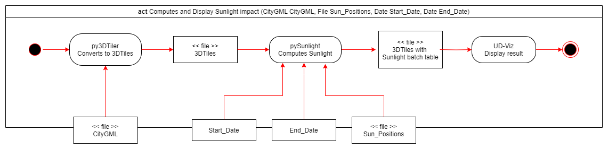

# Sunlight

### Pipeline - Activity Chart
Here is the pipeline we follow for Sunlight :


### Directory Hierarchy

```
Sunlight (repo)
├── datas                     # Datas use for testing
├── packages
|    ├── boost.1.82.0         # Boost is use to compare two string with better performance
|    ├── glm.0.9.9.800        # Mathematical and geometrical libraries (vec3, quat4...)
|
├── src                       # Source code
|    ├── ADE
|    ├── citygml                
|    ├── cores                # Core program / Main functionality
|    ├── maths                # Mathematical and geometrical class
|    ├── parsers
|    ├── third-partys         # Externals libraries (parser, mathematics...)
|        ├── libxml2-vc143	  # Parser XML for cityGML
|        ├── spdlog-1.11.0	  # Console and file logging
|
|    ├── utils                # Small utils / helpers (timer, operators override...)
|
├── .editorconfig             # Formatting rules and configuration
├── .gitattributes            # Define Large Files (.gml, .dat...)
├── .gitignore                # Files/folders ignored by Git
├── Readme.md
├── Sunlight.sln
├── Sunlight.vcxproj 
├── packages.config
```
